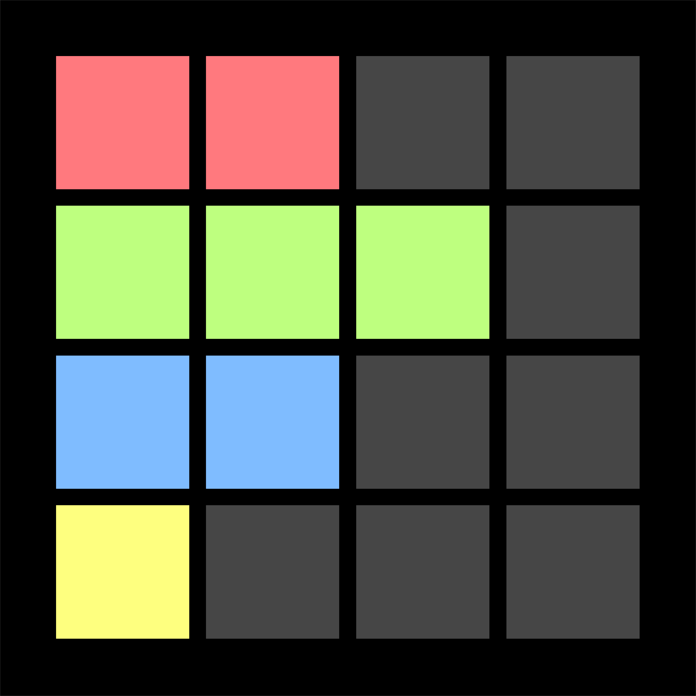
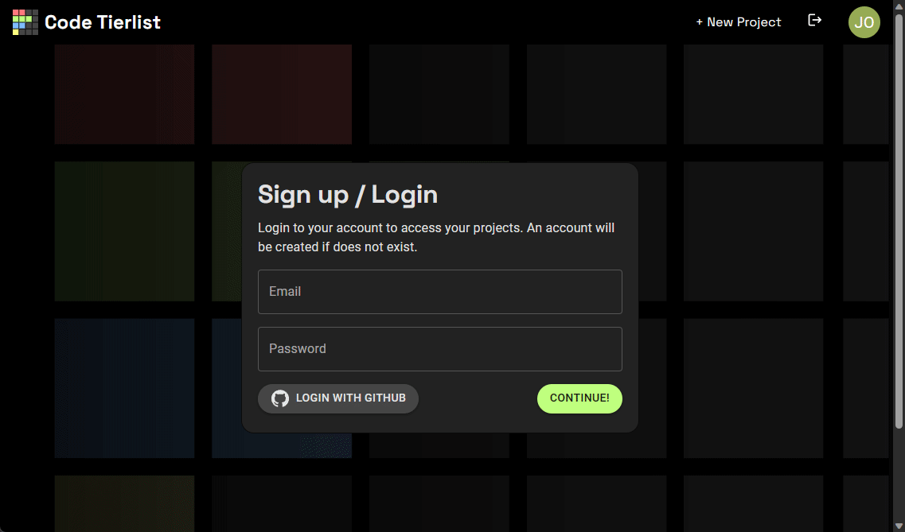

<h1><picture>
   
</picture>
Code Tierlist
</h1>

Ever wonder when you have completed an assignment and do not know how well you are doing compared to your fellow students.

As a leading place to test your code, we designed to give users(students) these opportunities so that students can know their progress compared to their peers while they are working on their assignments, to make coding **interactive**, **fun**, and **easier**.

On Code Tierlist, instructors can create new projects (assignments) for students. In each project, students are able to upload their own test cases and code, how well students do will be based on the accuracy of the students code in their own test cases, this will be shown in a tier list for students to see.

Follow along below to **learn more**:

<picture>
   
</picture>

## Navigation

- [Project homepage](https://codetierlist.tech/)
<picture>
   
</picture>

## Features

### Login features
For each course, only students enrolled are able to have access to the courses Code Tierlist.

### Tier List with real time updates
Continuously updating the accuracy of each students code and repositioning them in the tier list.

### Straightforward REST API
Allows for user addition of multiple files.

### Safety and Independent working
While students do provide their test cases and code to rank their progress, these will not be shown to other students. This is done to ensures students work independently.

## Deployment

### Tech stack:
* Frontend
    * Material UI <picture>
   
</picture>
    * Preact  
* Backend
    * NestJS  
    * Docker  

### Requirements:
Contact [support](mailto:support@codetierlist.tech)  for system requirements and setup. The software is currently under heavy development and thus requirements are not set in stone.

## Contributing

Code Tier List is **free and open-source software** licensed under the **MIT License**.

You can open issues for bugs you've found or features you think are missing. You can also submit pull requests to this repository.

## License
MIT License  
